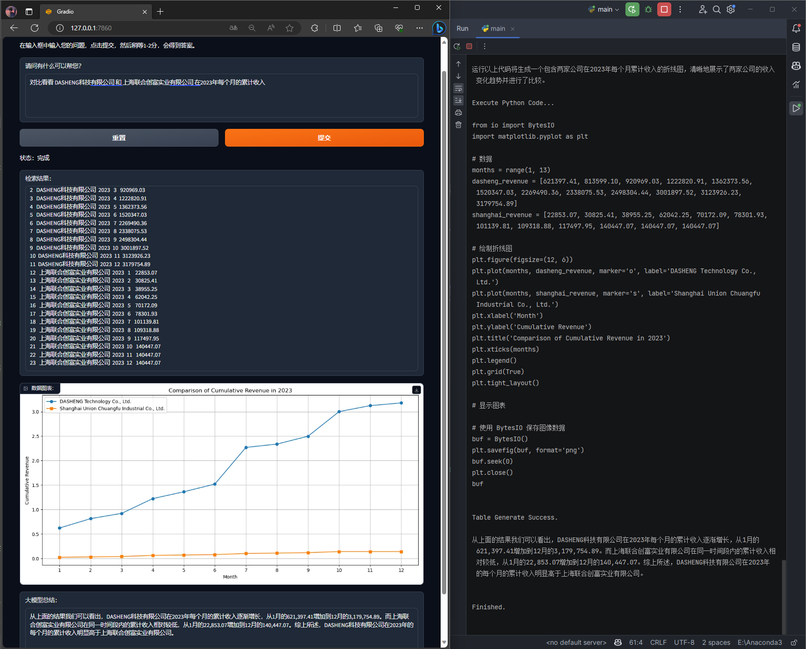
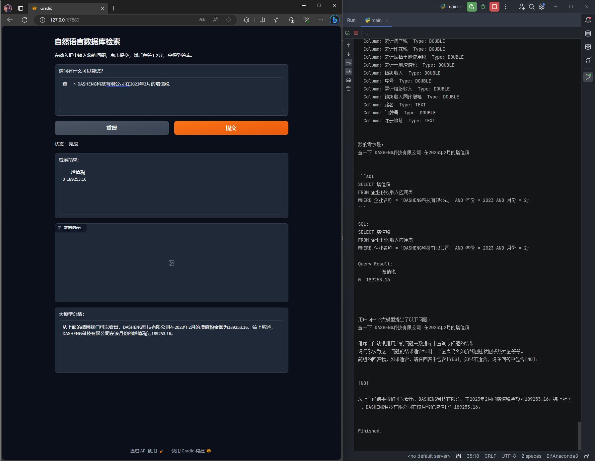
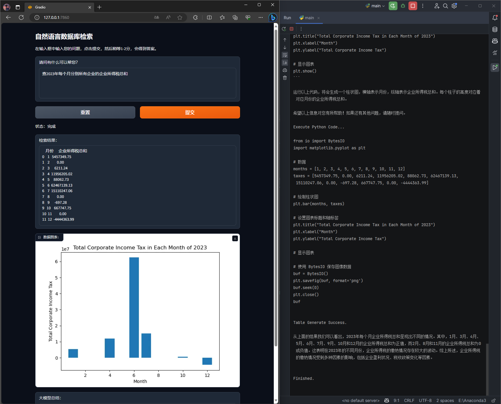
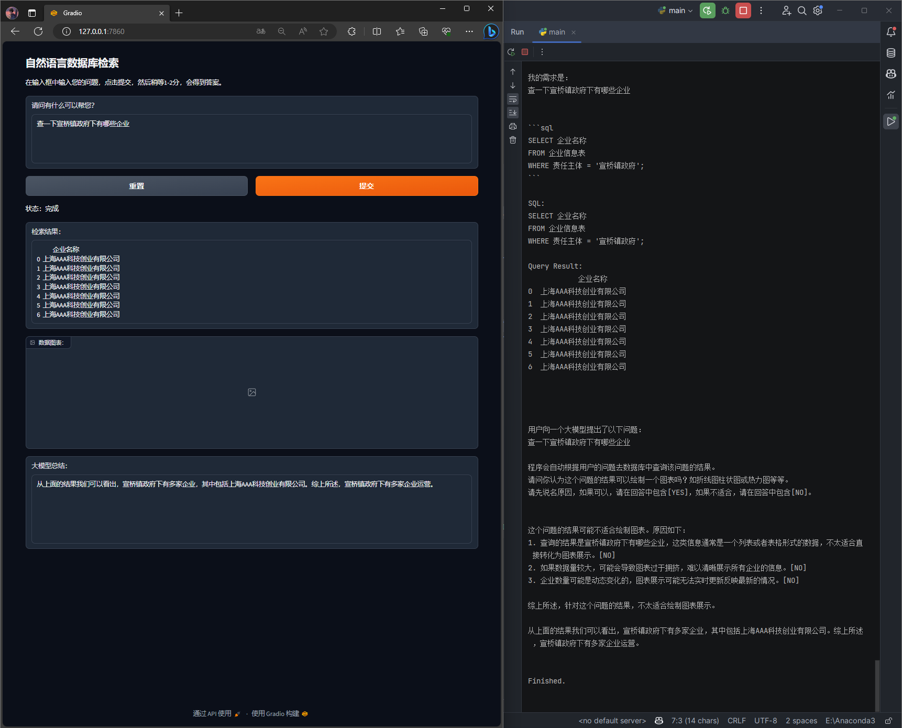
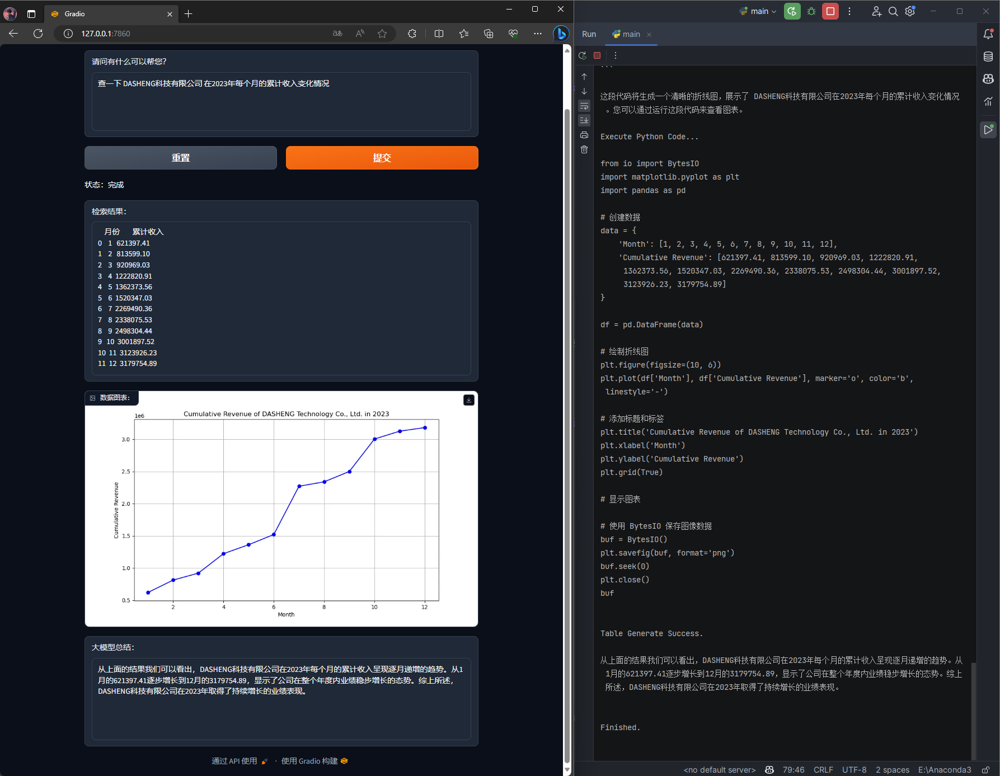

# DatabaseQueryGPT
 通过自然语言询问，能够自动判断数据库中的表结构及数据结构。，生成SQL语句在数据库中检索信息，展示数据。
 然后判断是否适合绘制图表并绘制，并做出最后总结。


### 一、效果展示

<details open>
<summary>展示效果图1</summary>
<div align="center">
  
</div>
</details>

<details open>
<summary>展示效果图2</summary>
<div align="center">
  
</div>
</details>

<details open>
<summary>展示效果图3</summary>
<div align="center">
  
</div>
</details>

<details>
<summary>展示效果图4</summary>
<div align="center">
  
</div>
</details>

<details>
<summary>展示效果图5</summary>
<div align="center">
  
</div>
</details>


### 二、代码简介

项目为简单Prompt工程，看似简单但功能实用而又全面。

背后所使用的大模型可以自行根据需求更换，当前举例了GPT4和KIMI。

1. main.py: 主程序入口。仅包含前端页面。
2. inference.py: 核心推理部分，包含了对话推理的主要逻辑。
3. structure.py: 数据库结构分析部分，负责提取数据库所有表结构及执行SQL。

其他文件较为简单，不再赘述。


### 三、代码使用

1. 安装依赖 openai matplotlib sqlalchemy pandas pymysql
```bash
pip install -r requirements.txt
```

<br/>

2. 填写大模型key，和数据库连接信息。信息放于secret目录下的txt文件。

<br/>

3. 确保数据库中有表，如果没有，可以使用`tools/excel_to_sql.py`将Excel转换为数据库表。

<br/>

4. 执行主程序
```bash
python main.py
```


